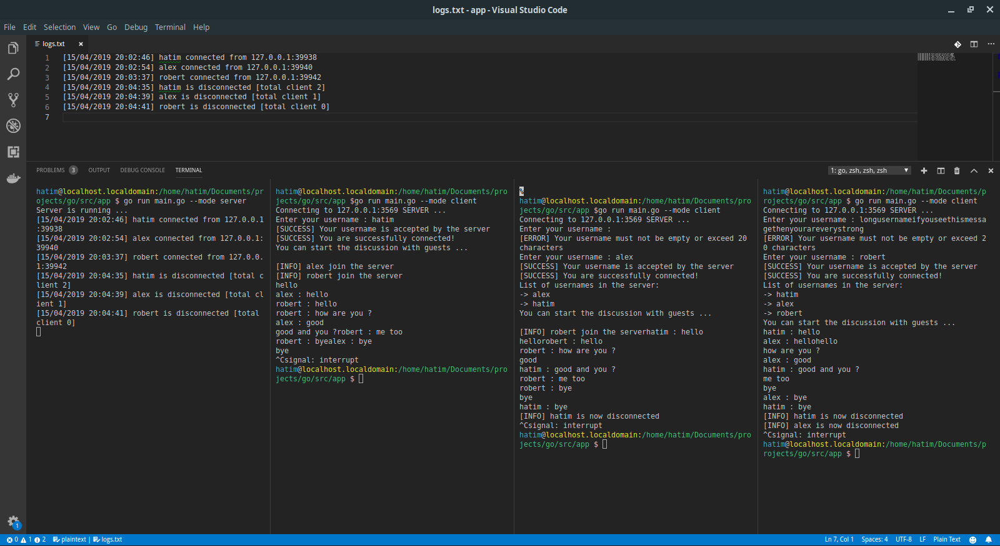

# Chat-application-in-go

## Description :

Instant messaging program that works in command prompt and writen with the go programming language.

## Prerequisites before running the script :

Install go compiler

## Screenshots


 
## How it run it :

- Create a server
  
  To create a discussion, you first must host a server :p. To do this, simply run the following command:

  ```shell
  go run main.go --mode server
  ```

- Create a client

  ```shell
  go run main.go --mode client
  ```

- then choose an username for your client in the command prompt to start the discussion

## Logs

A log file named logs.txt will be created when you will start your server. It tells you the different clients status

```
[15/04/2019 17:58:25] alex connected from 192.168.1.35:56662
[15/04/2019 17:58:42] alex is disconnected [total client 1]
[15/04/2019 18:08:36] hatim connected from 192.168.1.35:56782
[15/04/2019 18:08:42] hatim is disconnected [total client 0]
[15/04/2019 19:35:40] Client from 127.0.0.1:39586 interrupt the username input
```
